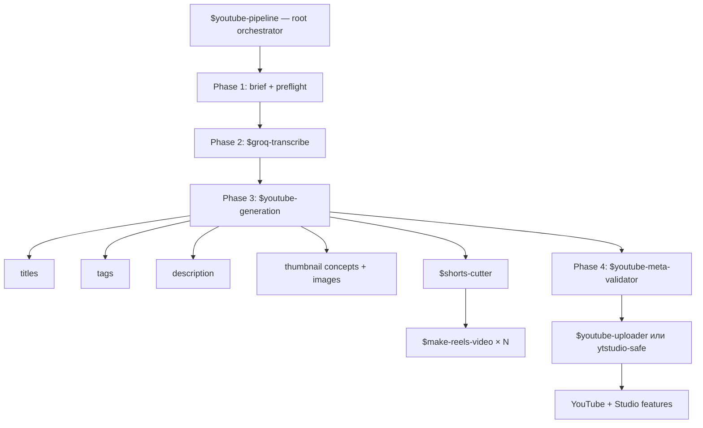

# YouTube Pipeline Skills

Полный русскоязычный YouTube-конвейер для Codex и Claude Code: транскрипт,
метаданные, обложки, производство Shorts/Reels, проверка, upload и Studio-функции.

Репозиторий не содержит чужих API keys, OAuth tokens, cookies, channel IDs,
персональных путей или готовых аккаунтов.

## Отдать репозиторий агенту

Отправьте агенту ссылку:

```text
https://github.com/sstani-bgv/youtube-pipeline
```

И следующий текст:

```text
Установи YouTube Pipeline из этого репозитория и полностью проведи onboarding.

1. Определи, работаю я в Codex, Claude Code или в обоих.
2. Сам установи недостающие системные зависимости для моей ОС:
   Python 3.10+, Git, uv, ffmpeg/ffprobe и Node.js/npm.
   Не перекладывай на меня ручные команды. Остановись только если ОС просит
   пароль администратора или системное подтверждение.
3. Клонируй репозиторий и установи bundle all вместе с runtime dependencies
   и login-only yt-studio:
   python3 install.py --target <codex|claude|both> --bundle all \
     --prepare-runtime --with-studio --force
4. Проверь версии uv, ffmpeg, ffprobe, hyperframes и ytstudio-safe.
5. Для Groq попроси меня только:
   - открыть https://console.groq.com/keys;
   - зарегистрироваться или войти;
   - нажать Create API Key;
   - вставить key в скрытый terminal prompt команды
     python3 configure_groq.py
   Никогда не проси прислать key в чат и не печатай его.
6. Для YouTube объясни риск private API и попроси подтвердить login-only режим.
   Открой отдельный профиль ytstudio-safe. Я только войду в Google/YouTube
   и выберу канал; дальнейший capture, channel guard и проверки выполни сам.
   Не используй мой обычный браузерный профиль.
7. Не загружай и не публикуй тестовое видео. Заверши onboarding read-only
   проверкой и дай короткий отчёт: что установлено, какие два credentials
   настроены и какие действия остались.
```

На Windows агент заменит `python3` на `py`.

Пользователь вручную делает только две вещи:

1. создаёт собственный key в [Groq Console](https://console.groq.com/keys) и
   вводит его в скрытый terminal prompt;
2. входит в Google/YouTube в отдельном окне и выбирает нужный канал.

## Что на самом деле входит в pipeline



Всего устанавливается 12 скиллов:

- `youtube-pipeline` — корневой оркестратор;
- `groq-transcribe` — Groq Whisper и clean transcript;
- `youtube-generation` — отдельный оркестратор генеративной фазы;
- `youtube-title-generator`;
- `youtube-seo-tags`;
- `youtube-description-writer`;
- `youtube-thumbnail-text-generator`;
- `youtube-thumbnail-image-generator`;
- `shorts-cutter`;
- `make-reels-video`;
- `youtube-meta-validator`;
- `youtube-uploader`.

`make-reels-video` действительно входит в комплект. Он создаёт один вертикальный
ролик, а `shorts-cutter` выбирает моменты и запускает отдельный production-agent
на каждый Short.

## Устанавливаемые bundles

Только базовый оркестратор и транскрибация:

```bash
python3 install.py --target codex --bundle core
```

Только отдельная генеративная фаза — metadata, thumbnails и Shorts/Reels:

```bash
python3 install.py --target codex --bundle generation --prepare-runtime
```

Только validator и официальный uploader:

```bash
python3 install.py --target codex --bundle publish
```

Всё сразу, включая заранее скачанные runtime dependencies и Studio adapter:

```bash
python3 install.py --target codex --bundle all \
  --prepare-runtime --with-studio
```

Для Claude Code используйте `--target claude`, для обоих — `--target both`.
Обновление выполняется той же командой с `--force`; старые версии сохраняются
рядом как backup.

## Groq: что требуется от пользователя

1. Открыть [Groq API Keys](https://console.groq.com/keys).
2. Зарегистрироваться или войти.
3. Нажать **Create API Key**.
4. Запустить:

```bash
python3 configure_groq.py
```

5. Вставить key в скрытый prompt.

Key сохраняется в `~/.config/groq-transcribe/.env` с правами `0600`. Он не
попадает в shell history и не выводится на экран. Аудио при транскрибации
отправляется в Groq API; для конфиденциальных материалов нужен локальный backend.

Официальная документация:
[API keys](https://console.groq.com/keys) и
[Speech to Text](https://console.groq.com/docs/speech-to-text).

## YouTube: login-only и официальный режим

### Login-only

Установщик `--with-studio` скачивает отдельный
[`yt-studio`](https://github.com/sstani-bgv/yt-studio), Playwright и браузер.
Пользователь входит в Google/YouTube в выделенном профиле; сессия сохраняется
локально и привязывается к выбранному channel ID.

Это неофициальный private API. Он удобен тем, что не требует создавать Google
Cloud project, но endpoints могут измениться, а автоматизация может нарушать
правила Google/YouTube. Первый live test проводите только на тестовом канале.

### Official YouTube Data API

Официальный uploader стабильнее, но одного логина недостаточно: Google требует
authorization credentials. Нужно один раз включить YouTube Data API и создать
Desktop OAuth client. Подробности:
[`skills/youtube-pipeline/references/SETUP.md`](skills/youtube-pipeline/references/SETUP.md).

Google подтверждает, что upload требует OAuth 2.0 и credentials:
[YouTube OAuth](https://developers.google.com/youtube/v3/guides/authentication) и
[desktop apps](https://developers.google.com/youtube/v3/guides/auth/installed-apps).

## Быстрый запуск после onboarding

Полный pipeline:

```text
Используй $youtube-pipeline. Вот финальное видео и brief.
Сначала создай все локальные assets и покажи audit. Ничего не публикуй без
моего отдельного разрешения.
```

Только Phase 3:

```text
Используй $youtube-generation. Создай metadata, A/B/C thumbnails и Shorts/Reels,
но ничего не загружай.
```

Только транскрипт:

```text
Используй $groq-transcribe и транскрибируй это видео на русском.
```

## Безопасные defaults

- все удалённые операции начинаются с dry-run;
- upload по умолчанию `private`;
- active channel сверяется с ожидаемым ID;
- `public` требует отдельного разрешения;
- receipts защищают от повторного upload;
- OAuth, Groq key, cookies и Studio session запрещено коммитить или пересылать.

## Лицензия

Скиллы и собственные helper scripts распространяются по MIT.

Опциональный `yt-studio` — отдельный GPL-3.0 проект.
